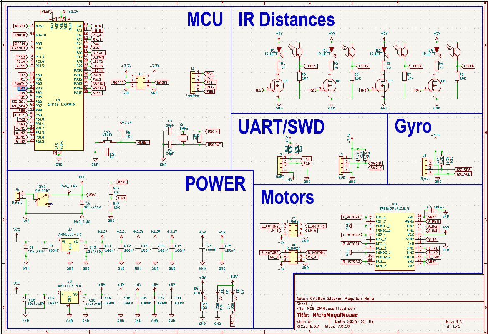
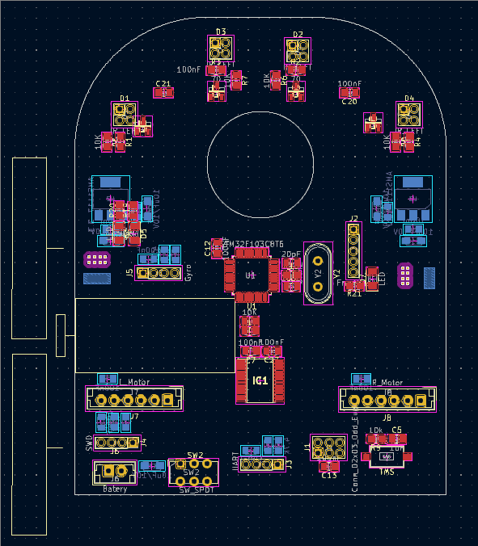
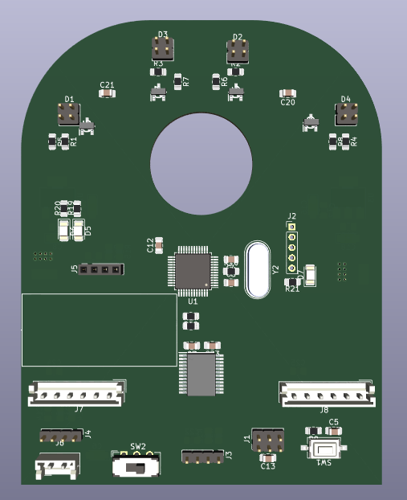
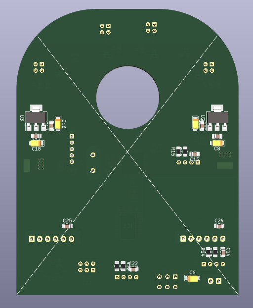

# MicroMouse
Design and implementation of a micromouse robot for competitions, implementing filling algorithm and other technologies

| Layout | PCB_1 | PCB_2 |
|--------|-------|-------|
|  |  |  |
